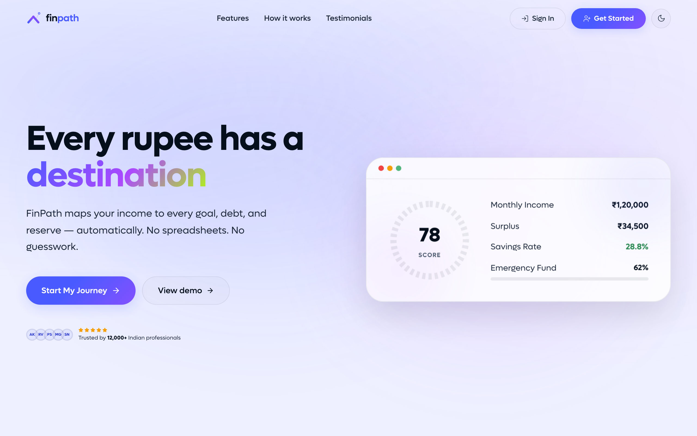
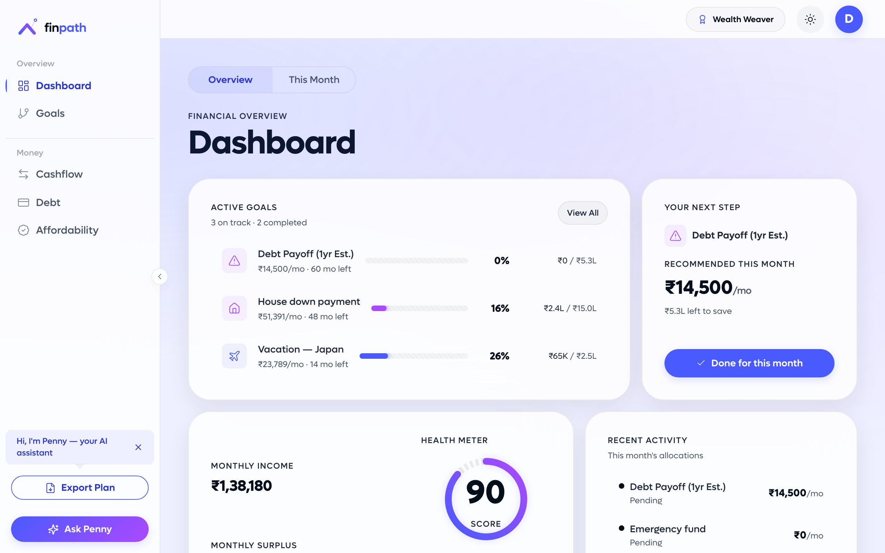
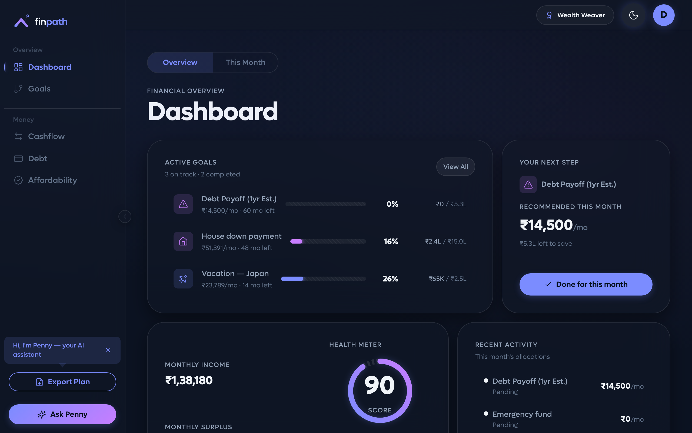
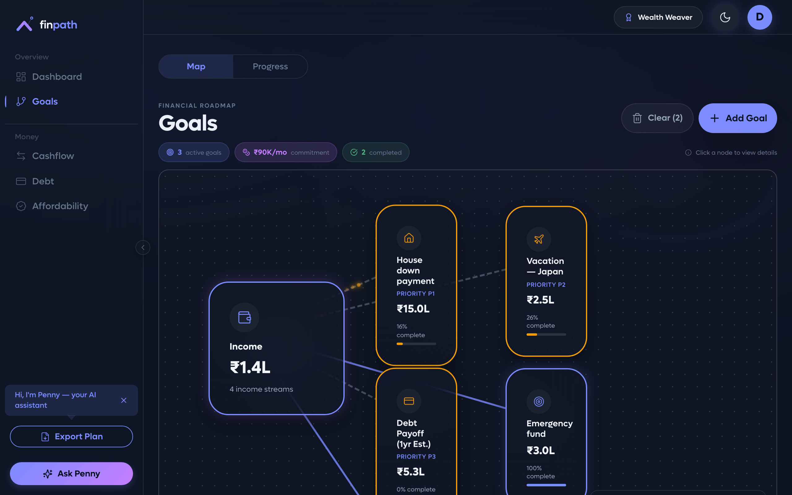
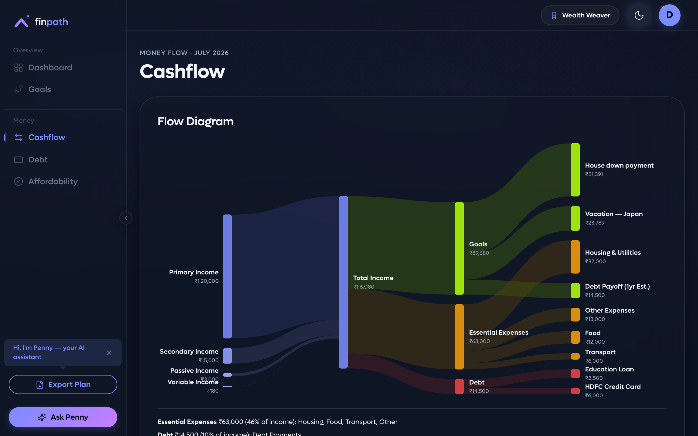
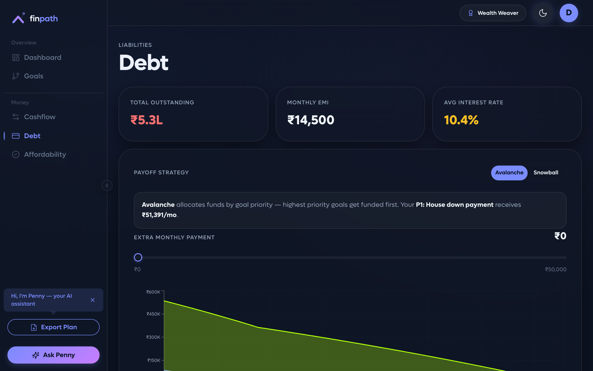
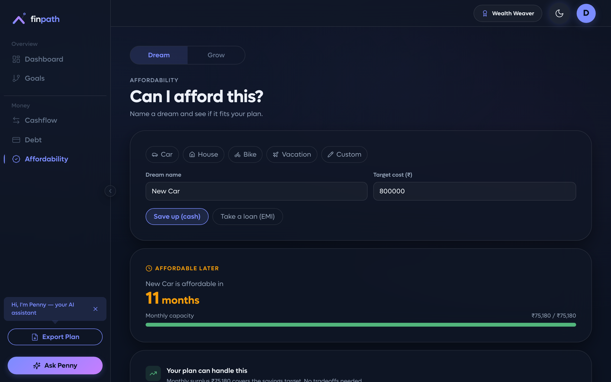

# FinPath — Precision Financial Planning

FinPath is a premium financial planning and journey-tracking application for Indian professionals. It moves beyond static budgeting with a dynamic, goal-focused roadmap that adapts to real-time financial changes, backed by a LangGraph-bound AI companion (Penny).

<p align="center">
  
</p>

## Contents

- [Screenshots](#screenshots)
- [Key Features](#key-features)
- [Tech Stack](#tech-stack)
- [Repository Layout](#repository-layout)
- [See It Running in 60 Seconds](#see-it-running-in-60-seconds) — no API keys needed
- [Full Setup](#full-setup) — real auth, real AI, real data
- [Script Reference](#script-reference)
- [Rerunning Just One Setup Step](#rerunning-just-one-setup-step)
- [Troubleshooting](#troubleshooting)
- [Design Philosophy](#design-philosophy)

## Screenshots

| | |
|---|---|
| **Dashboard** — health score, active goals, this month's recommendation | **Dashboard (dark mode)** |
|  |  |
| **Journey** — goal-centric roadmap canvas | **Cashflow** — Sankey income → expenses → goals |
|  |  |
| **Debt** — Avalanche vs. Snowball strategy | **Affordability** — scenario simulation |
|  |  |

There's also a live [Design System](docs/screenshots/design-system.png) reference page in the app at `/design`, showing every token, color, and component sourced straight from `theme.css`.

Screenshots go stale after a redesign — see [`pnpm screenshots`](#script-reference) to regenerate them, not hand-edit them.

## Key Features

- **Unified Financial Dashboard** — real-time health scores and personalized AI insights.
- **Goal-Centric Journey** — track Savings, Debt, and Lifestyle goals with interactive visualizations.
- **Strategy Engine** — Avalanche (interest-optimized) vs Snowball (momentum) debt payoff.
- **Dynamic "This Month's Impact"** — live feedback loop showing how today's actions affect long-term progress.
- **Interactive Cashflow** — Sankey diagram mapping income → expenses → goals.
- **Scenario Simulation** — salary increments, lumpsum payments, expense adjustments.
- **Penny AI** — Groq-backed financial companion that reads your full anonymized profile.

## Tech Stack

- **Frontend** — React 18 + TypeScript, Vite 6, Tailwind v4, Zustand v5, react-router v7, recharts, motion (Framer Motion)
- **Backend** — Python 3.11+ / FastAPI / uvicorn, Groq SDK, Supabase auth (JWT/JWKS)
- **Engines** — TS engines on frontend (instant UI), Python ports on backend (LangGraph tools)
- **Auth / DB** — Supabase (email/password, PostgreSQL with RLS)

## Repository Layout

```
.
├── frontend/                # React SPA (Vite + TypeScript)
│   ├── src/                 # Application code
│   ├── scripts/             # dev:backend launcher, fixture dumper, screenshot capture
│   ├── e2e/                 # Playwright end-to-end specs
│   ├── index.html
│   ├── vite.config.ts
│   ├── tsconfig.json
│   └── package.json
├── backend/                 # FastAPI (Python)
│   ├── app/
│   │   ├── api/             # Route modules (penny, simulate, profile)
│   │   ├── agents/          # LangGraph agent loop
│   │   ├── engines/         # Python ports of the TS engines
│   │   ├── services/        # Anonymize, cache, prompt, rate-limit, Groq, Supabase DB
│   │   ├── auth.py          # Supabase JWT (HS256 / RS256 / ES256 via JWKS)
│   │   ├── config.py        # Pydantic settings
│   │   └── main.py          # FastAPI app
│   ├── db/migrations/       # SQL schema
│   ├── tests/               # pytest parity tests
│   └── pyproject.toml
├── tests/fixtures/          # Shared JSON fixtures (TS dumper → Python pytest)
├── docs/screenshots/        # README images — regenerate with `pnpm screenshots`, don't hand-edit
└── README.md
```

## See It Running in 60 Seconds

No Supabase project, no Groq key, no `.env` file. This is the fastest way to look at the actual app — and it's also how the screenshots above were generated.

```bash
cd frontend
pnpm install
pnpm dev
```

Then open **http://localhost:5173/?demo=1** — this seeds a realistic demo profile straight into the store and drops you on the Dashboard. Click around Journey, Cashflow, Debt, Affordability freely; everything except Penny chat runs entirely in the browser (the health score, debt strategies, and plan generation are all pure TypeScript engines — no backend call).

What won't work in this mode: real sign-in/sign-up, cloud sync across devices, and asking Penny anything (that needs the backend + a Groq key — see below). Everything else is fully interactive.

## Full Setup

For real auth, cloud sync, and a working Penny AI.

### Prerequisites

- Node.js LTS (≥20) + pnpm (≥10)
- Python 3.11+
- A [Supabase](https://supabase.com) project (free tier is fine)
- A [Groq](https://console.groq.com) API key (free tier is fine) — only needed for Penny chat

### 1. Frontend

```bash
cd frontend
pnpm install
cp .env.example .env
```

Edit `frontend/.env`:
- Fill in `VITE_SUPABASE_URL` + `VITE_SUPABASE_ANON_KEY` from your Supabase project (**Settings → API**), *or*
- Set `VITE_AUTH_MOCK=true` to skip Supabase entirely and use an in-memory mock user (cloud sync stays off, everything else works).

### 2. Backend

```bash
cd backend
python -m venv .venv

# Windows
.\.venv\Scripts\Activate.ps1
# macOS / Linux
source .venv/bin/activate

pip install -e ".[dev]"
cp .env.example .env
```

Edit `backend/.env`:
- `GROQ_API_KEY` — required for Penny to actually respond.
- `SUPABASE_URL` + `SUPABASE_JWT_SECRET` — required to verify real user tokens (skip if you set `VITE_AUTH_MOCK=true` above and mirror it with `AUTH_MOCK=true` here).

### 3. Supabase schema (only if using real auth)

1. In the Supabase SQL editor, run `backend/db/migrations/001_init.sql` — creates `profiles`, `chat_history`, and `proposals` with row-level security.
2. Copy the project's JWT secret (**Settings → API → JWT Settings**) into `backend/.env` as `SUPABASE_JWT_SECRET`.

See [`backend/README.md`](backend/README.md) for the full endpoint list and auth details.

### 4. Run both servers

From `frontend/`:

```bash
pnpm dev:all
```

Boots:
- Backend → `http://127.0.0.1:8000`
- Frontend → `http://localhost:5173` (proxies `/api/*` to the backend)

Or run separately in two terminals: `pnpm dev:backend` and `pnpm dev`.

## Script Reference

All from `frontend/` unless noted.

| Command | What it does |
|---|---|
| `pnpm dev` | Start the frontend dev server alone. |
| `pnpm dev:backend` | Start the backend alone (uses `backend/.venv`). |
| `pnpm dev:all` | Start both, concurrently, in one terminal. |
| `pnpm build` | Production build. Must complete with 0 errors. |
| `pnpm test` | Vitest unit tests for the 3 TS engines (health score, debt strategies, plan). |
| `pnpm test:e2e` | Playwright end-to-end suite (auto-starts its own dev server). |
| `pnpm test:e2e:ui` | Same, with Playwright's interactive UI runner. |
| `pnpm typecheck` | `tsc --noEmit` — no emitted files, just type errors. |
| `pnpm lint` / `pnpm lint:fix` | ESLint, optionally auto-fixing. |
| `pnpm format` / `pnpm format:check` | Prettier, write or check-only. |
| `pnpm fixtures` | Regenerate `tests/fixtures/**/*.json` from the TS engines (see below). |
| `pnpm screenshots` | Regenerate `docs/screenshots/*.png` from a live instance of the app (see below). |
| `pytest` (from `backend/`) | Python parity tests — verifies the Python engine ports match the TS fixtures exactly. |

## Rerunning Just One Setup Step

You don't need to redo the whole setup after every change. Pick the row that matches what you touched:

| If you changed... | Rerun this |
|---|---|
| Frontend dependencies (`package.json`) | `pnpm install` (from `frontend/`) |
| Backend dependencies (`pyproject.toml`) | `pip install -e ".[dev]"` (from `backend/`, venv active) |
| A TS engine (`health-score.ts`, `debt-strategies.ts`, `plan-engine.ts`) | `pnpm fixtures`, then `pytest` (from `backend/`) to confirm the Python port still matches |
| Any screen's layout enough that the README screenshots look stale | `pnpm screenshots` |
| `backend/db/migrations/*.sql` (new migration added) | Re-run the new file's SQL in the Supabase SQL editor — migrations aren't auto-applied |
| Your `.env` values (new Supabase project, rotated Groq key) | Just edit the file and restart the affected dev server — no reinstall needed |
| Nothing, but want a completely clean local profile | Open the app and clear `localStorage` for `localhost:5173` (or visit in a private window) — there's no separate "reset" command, the store is the only local state |
| Nothing, but want to re-seed the demo profile | Revisit `/?demo=1` — safe to do anytime you're not already authenticated with real data |

## Troubleshooting

- **"Missing VITE_SUPABASE_URL" warning in the console** — expected if you haven't configured Supabase yet. The app still runs; auth and cloud sync are just disabled. Set `VITE_AUTH_MOCK=true` to silence it during local dev, or fill in the real values.
- **Penny doesn't respond / 401s** — check `backend/.env` has a real `GROQ_API_KEY`, and that `SUPABASE_JWT_SECRET` matches your project (or that `AUTH_MOCK=true` on both sides if you're not using real auth).
- **Port already in use** — the frontend defaults to `5173`, backend to `8000`. Override with `VITE_BACKEND_URL` (frontend, points at a different backend) or edit `HOST`/`PORT` in `backend/.env`.
- **`pnpm test:e2e` fails to launch a browser** — run `pnpm exec playwright install chromium` once; Playwright's browser binaries aren't installed by `pnpm install` alone.
- **Fixture/parity tests fail after changing an engine** — you changed the TS engine but forgot `pnpm fixtures`; the Python tests compare against the last-generated JSON, not the live TS code.

## Design Philosophy

Premium, structured aesthetic:
- **Unified backgrounds** — global blue / purple radial gradient.
- **Glassmorphism** — `.bento-card` with backdrop-blur and subtle borders.
- **Micro-animations** — pulsing progress, animated transitions, all respecting `prefers-reduced-motion`.

---
*Created by the FinPath Team.*
